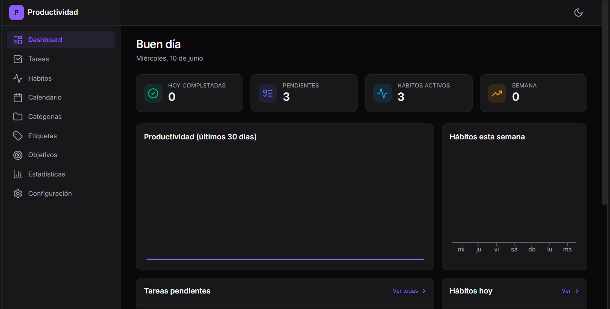
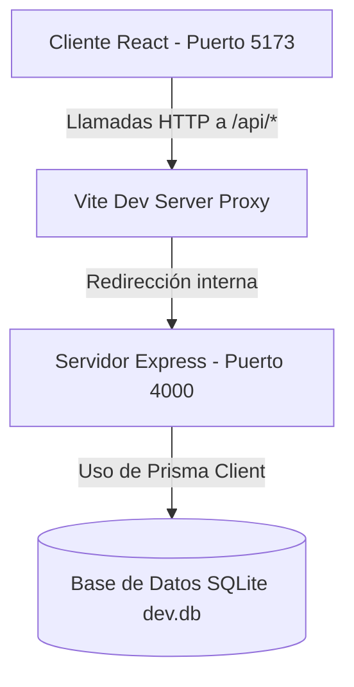

# 🚀 Sistema de Productividad Personal (Local-First by Vibecoding) 1.0.0v

Una plataforma modular de productividad personal al estilo **Notion + Todoist + Google Calendar + Habit Tracker**, diseñada bajo el concepto **Local-First** para garantizar total privacidad, rapidez y control de tus datos sin depender de servidores en la nube.

<p align="center">
  
  
  
  
  <br>
  
  
  
  
  
  
</p>

---

## 📋 Índice
1. [Características Principales](#-características-principales)
2. [Rendimiento y Escalabilidad](#-rendimiento-y-escalabilidad-métricas-reales)
3. [Tecnologías Utilizadas](#%EF%B8%8F-tecnologías-utilizadas)
4. [Arquitectura y Estructura del Proyecto](#-arquitectura-y-estructura-del-proyecto)
5. [¿Cómo Funciona? (Flujo de la Aplicación)](#-cómo-funciona-flujo-de-la-aplicación)
6. [Base de Datos y Modelos](#-base-de-datos-y-modelos)
7. [Instalación y Configuración](#-instalación-y-configuración)
8. [Scripts Disponibles](#-scripts-disponibles)
9. [Referencia de la API REST](#-referencia-de-la-api-rest)
10. [Seguridad y Respaldos](#-seguridad-y-respaldos)

---

## ✨ Características Principales

El sistema se compone de varios módulos integrados que interactúan de forma fluida:

*   📊 **Dashboard de Control**: Una vista centralizada con widgets dinámicos para ver tareas prioritarias hoy, seguimiento rápido de hábitos, eventos próximos en el calendario y progreso de objetivos del mes.
*   📋 **Gestor de Tareas**: Soporta flujo completo de tareas con campos para descripción, fecha límite, hora, notas y progreso numérico. Ofrece vistas en:
    *   **Lista Tradicional**: Organizada por prioridad y estado.
    *   **Tablero Kanban**: Permite arrastrar y soltar (*drag and drop*) para cambiar de estado rápidamente.
    *   **Calendario**: Integración visual de tareas con fechas límite.
*   🔁 **Seguimiento de Hábitos**: Configuración de hábitos con frecuencia diaria o personalizada (ej. Lunes, Miércoles y Viernes). Incluye registro diario de progreso y cálculo automático de rachas (*streaks*).
*   📅 **Calendario Unificado**: Calendario interactivo (mes, semana, día y agenda) potenciado por *FullCalendar* que unifica eventos creados manualmente y tareas con fecha límite.
*   🎯 **Objetivos y Metas**: Creación de metas temporales (diarias, semanales, mensuales o anuales) con valor objetivo y actual para calcular el progreso porcentual.
*   📈 **Módulo de Estadísticas**: Gráficos analíticos dinámicos basados en *Recharts* que muestran la distribución de tareas por prioridad, hábitos completados a lo largo del tiempo e índices de productividad general.
*   🗂️ **Categorías y Etiquetas**: Sistema jerárquico de carpetas con colores e iconos personalizables para clasificar todas tus actividades (ej. "Trabajo", "Personal", "Salud"). Además de etiquetas globales para organización cruzada.
*   ⚙️ **Configuración y Apariencia**: Personalización completa que incluye:
    *   **Temas**: Claro, Oscuro o Sincronizado con el Sistema.
    *   **Color de Acento**: Selección dinámica del color primario de la aplicación.
    *   **Escala de Fuente**: Modificación del tamaño del texto base.
    *   **Seguridad**: Bloqueo opcional por PIN local guardado como hash en base de datos.
    *   **Backup**: Exportación completa a JSON/CSV e importación directa desde la UI.

---

## ⚡ Rendimiento y Escalabilidad (Métricas Reales)

> Todas las cifras de esta sección son **medidas**, no estimadas. Se obtuvieron con herramientas estándar de la industria (Google Lighthouse, `EXPLAIN QUERY PLAN` de SQLite y benchmarks de latencia sobre HTTP) ejecutadas contra el *build de producción* de este mismo repositorio. Cada apartado incluye la metodología para que cualquiera pueda reproducirlas.

Bajo la premisa **Local-First**, el objetivo de ingeniería no es "aguantar carga masiva" (es una app mono-usuario), sino **minimizar latencia y peso** eliminando el trabajo innecesario del camino crítico: menos JavaScript bloqueante en el arranque, agregaciones resueltas en una sola pasada y consultas que atacan índices en lugar de escanear tablas.

### 🎨 Frontend — Google Lighthouse

Auditoría de Lighthouse sobre el `build` de producción servido localmente (Chrome headless), en perfiles móvil y escritorio:

| Categoría | 📱 Móvil | 🖥️ Escritorio |
| :--- | :---: | :---: |
| **Performance** | 82 * | **100** |
| **Accessibility** | **100** | **100** |
| **Best Practices** | **100** | **100** |
| **SEO** | **100** | **100** |

<sub>\* En móvil, Lighthouse simula una CPU 4× más lenta; la puntuación de *Performance* oscila ~80 según la carga de la máquina, mientras que el LCP se mantiene estable. El resto de categorías son consistentes en 100.</sub>

**Core Web Vitals:**

| Métrica | 📱 Móvil | 🖥️ Escritorio | Umbral "Bueno" |
| :--- | :---: | :---: | :---: |
| **LCP** (Largest Contentful Paint) | 3.1 s | **0.8 s** | < 2.5 s |
| **TBT** (Total Blocking Time) | ~300 ms | **~50 ms** | < 200 ms |
| **CLS** (Cumulative Layout Shift) | 0.00 | 0.02 | < 0.1 |

### 📦 Optimización del Bundle — Code Splitting

El punto de entrada empaquetaba **toda** la aplicación (incluidas librerías pesadas de visualización) en un único fichero JavaScript. Se aplicó **carga diferida por ruta** (`React.lazy` + `Suspense`) y **separación manual de vendors** (`manualChunks` de Rollup/Vite), sacando del arranque las dependencias que solo se usan en secciones concretas:

| | Antes | Después |
| :--- | :--- | :--- |
| **JS de arranque (gzip)** | **365 kB** (un solo chunk) | **~136 kB** en la ruta de entrada |
| **Nº de chunks** | 1 monolítico | 25 (cacheables por separado) |
| **Recharts** (411 kB) | En el bundle inicial | Diferido → solo en `/estadisticas` |
| **FullCalendar** (268 kB) | En el bundle inicial | Diferido → solo en `/calendario` |

> **679 kB de librerías de visualización (el ~54 % del bundle original) salieron de la ruta crítica**, reduciendo el JavaScript bloqueante del primer render en **~63 %**. Vite deja de emitir el aviso de *chunk > 500 kB*.

### 🔎 SEO Técnico Profesional (Lighthouse SEO 100/100)

El `index.html` no se sirve "pelado": implementa una capa de SEO técnico de nivel producción que consigue **puntuación perfecta de SEO (100) y Accesibilidad (100)** en Lighthouse, con **cero auditorías fallidas**. Todo está declarado de forma estática, por lo que es visible para los *crawlers* incluso antes de que hidrate React.

| Optimización | Implementación | Beneficio |
| :--- | :--- | :--- |
| **Meta description** optimizada | `<meta name="description">` (~160 car.) | *Snippet* atractivo en resultados de búsqueda |
| **Open Graph** completo | `og:title`, `og:description`, `og:image`, `og:url`, `og:locale`… | Preview enriquecido al compartir en LinkedIn / Facebook / WhatsApp |
| **Twitter Cards** | `summary_large_image` con imagen 1607×816 | Tarjeta visual grande al compartir en X |
| **Datos estructurados** | JSON-LD `schema.org/WebApplication` | Elegibilidad para *rich results* en Google |
| **URL canónica** | `<link rel="canonical">` | Evita contenido duplicado |
| **Directivas de robots** | `index, follow, max-image-preview:large` | Control explícito del rastreo/indexación |
| **`robots.txt` + `sitemap.xml`** | Ficheros estáticos en `public/` | Rastreo guiado de las 6 rutas principales |
| **PWA / `site.webmanifest`** | `theme-color`, iconos maskable 192/512, `apple-touch-icon` | Instalable, con marca coherente en móvil |
| **Fallback `<noscript>`** | Contenido semántico sin JS | Accesible para bots que no ejecutan JavaScript |
| **`lang="es"` + semántica** | Idioma declarado, jerarquía de encabezados | Accesibilidad 100 |

> **Resultado:** el sitio pasa de un SEO de 82 a **100/100**, entrega una tarjeta social profesional al compartirse y es indexable, instalable como PWA y accesible. Es la diferencia entre "un proyecto que funciona" y "un proyecto listo para producción".
>
> ℹ️ Las URLs absolutas (`og:url`, `canonical`, `sitemap`) usan un dominio de ejemplo — sustitúyelo por tu dominio real de Netlify en `client/index.html`, `robots.txt` y `sitemap.xml` tras el despliegue.

### 🗄️ Backend — Latencia de la API

Benchmark de latencia sobre HTTP (500 peticiones por endpoint, tras *warm-up*) contra el stack completo `Express → Prisma → SQLite`. El endpoint más pesado, `GET /stats/summary`, resuelve **6 agregaciones en paralelo** (`Promise.all`) más el cálculo de series temporales de 30 días en memoria:

| Endpoint | Media | p95 | p99 |
| :--- | :---: | :---: | :---: |
| `GET /stats/summary` (dashboard) | 13.3 ms | 30.3 ms | 34.6 ms |
| `GET /tasks` (listado + relaciones) | 5.1 ms | 6.3 ms | 9.4 ms |
| `GET /habits` (con historial de logs) | 4.4 ms | 5.1 ms | 6.3 ms |

*El listado de tareas evita el problema **N+1** cargando `category`, `tags` y `reminders` en una única consulta batcheada mediante `include` de Prisma.*

### 🔍 Optimización de Base de Datos — Índice Compuesto

Escenario de escala controlado: se sembró una copia desechable de la base de datos con **50.000 tareas** y se midió la consulta caliente del dashboard (`WHERE status = ? AND completedAt >= ?`) **antes y después** de añadir un índice compuesto `@@index([status, completedAt])`, verificando el plan de ejecución real con `EXPLAIN QUERY PLAN`:

| | Plan de ejecución | Tiempo (mediana, 40 corridas) |
| :--- | :--- | :---: |
| **Antes** | `SCAN Task` (escaneo completo) | 7.56 ms |
| **Después** | `SEARCH Task USING COVERING INDEX` | **0.596 ms** |

$$\text{Mejora} = \frac{7.56 - 0.596}{7.56} \times 100 = \mathbf{92.1\%}$$

> El índice pasó de un *full table scan* a un **covering index** (SQLite resuelve la consulta leyendo solo el índice, sin tocar la tabla). El índice está aplicado en [`schema.prisma`](file:///c:/Users/USUARIO%20LENOVO/Desktop/Codigo/WSP/FRONT/Portafolio/Gestion_tareas/server/prisma/schema.prisma) y respaldado por los patrones de consulta reales de `stats.ts` y `tasks.ts`.

---

## 🛠️ Tecnologías Utilizadas

La aplicación está construida sobre un entorno moderno y robusto con JavaScript / TypeScript:

### Frontend (Cliente)
*   **React 18** (Vite como empaquetador)
*   **TypeScript** para tipado estático seguro.
*   **Tailwind CSS** para un diseño adaptativo y estilizado mediante variables CSS dinámicas.
*   **Zustand** para la gestión ágil del estado de la UI (con persistencia local del tema).
*   **FullCalendar** para el renderizado interactivo del calendario mensual/semanal.
*   **Recharts** para los gráficos de la sección de estadísticas.
*   **Framer Motion** para animaciones fluidas y microinteracciones.
*   **Lucide React** para la iconografía de la aplicación.

### Backend (Servidor)
*   **Node.js** + **Express** como framework para la API REST.
*   **TypeScript** (compilado a JS con `tsc` y ejecutado en desarrollo mediante `tsx`).
*   **Prisma ORM** para la gestión, migración y consultas a la base de datos de forma tipada.
*   **Zod** para la validación estricta de las cargas de datos (payloads) en los endpoints de la API.

### Base de Datos
*   **SQLite**: Base de datos relacional integrada en un archivo local (`dev.db`), ideal para aplicaciones de escritorio locales o auto-hospedadas.

---

## 📁 Arquitectura y Estructura del Proyecto

El proyecto está organizado en un monorepo administrado a través de **npm Workspaces**, lo que permite instalar dependencias globales y ejecutar comandos para ambos proyectos simultáneamente desde la raíz.

```
Gestion_tareas/
├── client/                     # Frontend de la aplicación (React + Vite)
│   ├── public/                 # Recursos públicos estáticos (iconos, etc.)
│   ├── src/                    # Código fuente del cliente
│   │   ├── components/         # Componentes UI reutilizables y modulares (shadcn-like)
│   │   ├── hooks/              # Hooks personalizados de React
│   │   ├── layouts/            # Estructura y layout principal de la app (AppLayout.tsx)
│   │   ├── lib/                # Utilidades comunes (conversión de colores, formateo de fechas)
│   │   ├── pages/              # Vistas principales de la aplicación por módulo
│   │   ├── services/           # Cliente HTTP personalizado (Fetch API centralizado)
│   │   ├── store/              # Almacenamiento de estado global con Zustand (theme.ts)
│   │   ├── types/              # Definición de interfaces TypeScript compartidas
│   │   ├── App.tsx             # Componente raíz y enrutador del cliente
│   │   └── main.tsx            # Punto de entrada de React
│   ├── package.json            # Dependencias y scripts del frontend
│   └── vite.config.ts          # Configuración del servidor de desarrollo Vite + Proxy REST
├── server/                     # Backend de la aplicación (Node.js + Express)
│   ├── prisma/                 # Archivos de base de datos y ORM
│   │   ├── dev.db              # Base de datos local SQLite (generada al instalar)
│   │   └── schema.prisma       # Definición del esquema y relaciones de base de datos
│   ├── src/                    # Código fuente del backend
│   │   ├── lib/                # Utilidades de backend (manejador asíncrono)
│   │   ├── middleware/         # Middleware de Express (controlador de errores globales)
│   │   ├── routes/             # Endpoints modulares de Express agrupados por entidad
│   │   ├── db.ts               # Instanciación y exportación del cliente Prisma
│   │   ├── index.ts            # Inicialización del servidor Express y configuración inicial
│   │   └── seed.ts             # Script de datos iniciales (semilla de ejemplo)
│   ├── package.json            # Dependencias y scripts del backend
│   └── tsconfig.json           # Configuración del compilador TypeScript para backend
├── package.json                # Configuración del Monorepo y scripts globales
└── README.md                   # Documentación del proyecto
```

---

## ⚙️ ¿Cómo Funciona? (Flujo de la Aplicación)

### 1. Concepto Local-First y Almacenamiento
A diferencia de las arquitecturas SaaS tradicionales, en este sistema tus datos no viajan a una nube externa administrada por terceros:
*   **Persistencia de Datos**: Toda la información de tus tareas, hábitos, metas, eventos y categorías se almacena en el archivo de base de datos SQLite ubicado en `server/prisma/dev.db`.
*   **Persistencia de Interfaz**: Configuración de apariencia (si prefieres tema oscuro o claro, o qué color primario te gusta) se almacena en el navegador mediante `localStorage` a través del middleware de Zustand en el frontend. El backend también guarda una copia en la tabla `Settings` para configuraciones generales como idioma y formato de fechas.

### 2. Comunicación Cliente-Servidor en Desarrollo

*   **Proxy de Desarrollo**: Para evitar problemas de CORS y simular un entorno de producción unificado, [vite.config.ts](file:///c:/Users/USUARIO%20LENOVO/Desktop/Codigo/WSP/FRONT/Portafolio/Gestion_tareas/client/vite.config.ts) incluye un proxy que redirige automáticamente todas las llamadas con prefijo `/api` hechas en el cliente hacia el servidor backend en `http://localhost:4000`.
*   **Consumo de API**: El archivo [api.ts](file:///c:/Users/USUARIO%20LENOVO/Desktop/Codigo/WSP/FRONT/Portafolio/Gestion_tareas/client/services/api.ts) expone un cliente HTTP sencillo que utiliza `fetch` nativo para comunicarse de forma limpia con los endpoints del backend.

### 3. Carga Inicial y Configuración
Al iniciar el servidor en [index.ts](file:///c:/Users/USUARIO%20LENOVO/Desktop/Codigo/WSP/FRONT/Portafolio/Gestion_tareas/server/src/index.ts), se asegura de que exista al menos una fila en la tabla de configuración (`Settings` con ID 1). Si no existe, realiza un *upsert* para crearla con los valores por defecto.

---

## 🗄️ Base de Datos y Modelos

El modelo de datos relacional está definido en el archivo [schema.prisma](file:///c:/Users/USUARIO%20LENOVO/Desktop/Codigo/WSP/FRONT/Portafolio/Gestion_tareas/server/prisma/schema.prisma). Las relaciones clave son:

*   **Category**: Es recursiva (una categoría puede tener subcategorías, `parentId`). Tareas, Hábitos, Eventos y Objetivos pueden opcionalmente enlazarse a una Categoría. Si la categoría se elimina, la relación se vuelve `SET NULL` en cascada.
*   **Task - Tag**: Relación muchos a muchos implementada explícitamente mediante la tabla intermedia `TaskTag`.
*   **Habit - HabitLog**: Relación de uno a muchos. Cada registro diario (`HabitLog`) contiene la fecha exacta de ejecución y el recuento de completado. Para evitar duplicaciones del mismo hábito en el mismo día, la tabla tiene una llave única combinada `[habitId, date]`.
*   **Reminder**: Tabla polimórfica que permite asociar un recordatorio programado a una tarea, un hábito o un evento mediante llaves foráneas opcionales (`taskId`, `habitId`, `eventId`).

---

## 🛠️ Instalación y Configuración

Sigue estos pasos para arrancar el entorno de desarrollo local:

### Requisitos Previos
*   Tener instalado **Node.js** (versión 18 o superior recomendada).
*   Un gestor de paquetes como `npm` (incluido con Node.js).

### Pasos
1.  **Clonar el repositorio** a tu máquina local.
2.  **Instalar dependencias**: Ejecuta el siguiente comando en la raíz del proyecto:
    ```bash
    npm install
    ```
    > [!NOTE]
    > Al terminar la instalación, el script de ciclo de vida `postinstall` configurado en [package.json](file:///c:/Users/USUARIO%20LENOVO/Desktop/Codigo/WSP/FRONT/Portafolio/Gestion_tareas/package.json) ejecutará automáticamente la inicialización de la base de datos: generará el cliente Prisma, creará la estructura SQLite local (`server/prisma/dev.db`) si no existe, y poblará la base de datos con datos semilla de ejemplo definidos en [seed.ts](file:///c:/Users/USUARIO%20LENOVO/Desktop/Codigo/WSP/FRONT/Portafolio/Gestion_tareas/server/src/seed.ts).

3.  **Iniciar la aplicación**: Levanta tanto el backend como el frontend en paralelo usando:
    ```bash
    npm run dev
    ```
    *   El frontend estará disponible en: `http://localhost:5173`
    *   El backend escuchará en: `http://localhost:4000`

---

## ⌨️ Scripts Disponibles

Todos estos comandos se pueden ejecutar directamente desde la **raíz del proyecto**:

| Comando | Descripción |
| :--- | :--- |
| `npm run dev` | Inicia el servidor de Express y el de Vite de forma paralela (usando `concurrently`). |
| `npm run build` | Compila el backend (a JavaScript en `server/dist`) y compila/empaqueta el frontend listo para producción. |
| `npm run start` | Arranca el backend compilado en producción (`server/dist/index.js`). |
| `npm run db:studio` | Abre **Prisma Studio** en el navegador (`localhost:5555`), una interfaz visual interactiva para ver y editar tu base de datos SQLite. |
| `npm run db:seed` | Vuelve a correr el script de semillas en la base de datos local para crear registros de prueba. |
| `npm run db:reset` | **Cuidado**: Elimina todos los datos de la base de datos local SQLite, recrea la base de datos y ejecuta el script de semillas. |

---

## 📡 Referencia de la API REST

Los principales endpoints que expone el backend Express para el consumo del frontend son:

### Tareas (`/api/tasks`)
*   `GET /api/tasks` - Obtiene todas las tareas (incluyendo categorías y etiquetas asociadas).
*   `POST /api/tasks` - Crea una nueva tarea (valida prioridad, título y estados con Zod).
*   `PUT /api/tasks/:id` - Actualiza campos de una tarea (p. ej., marcar como completada).
*   `DELETE /api/tasks/:id` - Elimina una tarea.

### Hábitos (`/api/habits`)
*   `GET /api/habits` - Obtiene la lista de hábitos vigentes con su respectivo historial de registros (`logs`).
*   `POST /api/habits` - Crea un hábito con su objetivo diario/semanal y frecuencia.
*   `POST /api/habits/:id/log` - Registra/actualiza un día de cumplimiento para el hábito (añade un `HabitLog`).
*   `DELETE /api/habits/:id` - Elimina o archiva un hábito.

### Objetivos/Metas (`/api/goals`)
*   `GET /api/goals` - Lista de metas activas con cálculo dinámico de progreso.
*   `POST /api/goals` - Crea un nuevo objetivo indicando el rango de fechas y unidad de medida.
*   `PATCH /api/goals/:id` - Actualiza el progreso de cumplimiento (p. ej., aumentar el contador).

### Calendario/Eventos (`/api/events`)
*   `GET /api/events` - Retorna los eventos en un rango de fechas.
*   `POST /api/events` - Añade un nuevo evento.
*   `DELETE /api/events/:id` - Remueve un evento del calendario.

### Respaldo (`/api/backup`)
*   `GET /api/backup/export` - Compila todas las tablas del esquema local en un archivo JSON único para descarga.
*   `POST /api/backup/import` - Recibe un payload JSON para restaurar/reemplazar la base de datos local.

---

## 🛡️ Seguridad y Respaldos

### Copias de seguridad manuales
Dado que toda la información se guarda localmente en SQLite, puedes realizar una copia de seguridad rápida copiando el archivo físico de la base de datos.
En sistemas Linux/Mac:
```bash
cp server/prisma/dev.db backup-$(date +%F).db
```
En Windows (PowerShell):
```powershell
Copy-Item "server/prisma/dev.db" -Destination "backup-$(Get-Date -Format 'yyyy-MM-dd').db"
```

### Seguridad por PIN
El backend ofrece endpoints para configurar y verificar un PIN de seguridad en `/settings/pin` e incluso validar un inicio de sesión local mediante `/settings/pin/verify`. El PIN es encriptado en el servidor usando un hash **SHA-256** unidireccional y se almacena en la columna `pinHash` de la tabla `Settings`.