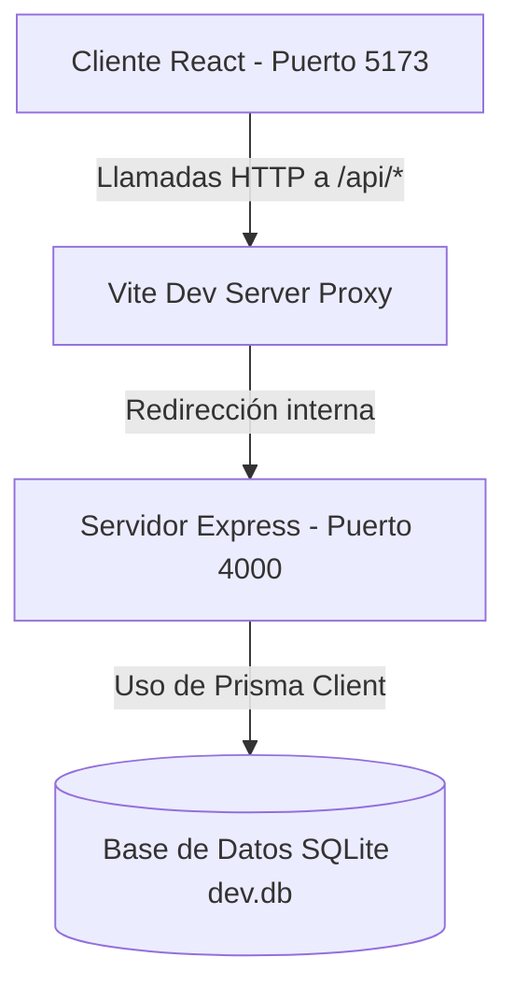

# 🚀 Sistema de Productividad Personal (Local-First by Vibecoding) 1.0.0v

Una plataforma modular de productividad personal al estilo **Notion + Todoist + Google Calendar + Habit Tracker**, diseñada bajo el concepto **Local-First** para garantizar total privacidad, rapidez y control de tus datos sin depender de servidores en la nube.

/server funcionaría en producción
Actualmente en servicios gratuitos se muestra archivos estáticos.

<p align="center">
  
  
  
  
  <a href="https://task-gestor.netlify.app/"></a>
  <br>
  
  
  
  
  
  
</p>

---

## 📋 Índice
1. [Características Principales](#-características-principales)
2. [Rendimiento y Escalabilidad](#-rendimiento-y-escalabilidad-métricas-reales)
3. [Tecnologías Utilizadas](#%EF%B8%8F-tecnologías-utilizadas)
4. [Arquitectura y Estructura del Proyecto](#-arquitectura-y-estructura-del-proyecto)
5. [¿Cómo Funciona? (Flujo de la Aplicación)](#-cómo-funciona-flujo-de-la-aplicación)
6. [Base de Datos y Modelos](#-base-de-datos-y-modelos)
7. [Instalación y Configuración](#-instalación-y-configuración)
8. [Scripts Disponibles](#-scripts-disponibles)
9. [Referencia de la API REST](#-referencia-de-la-api-rest)
10. [Seguridad y Respaldos](#-seguridad-y-respaldos)

---

## ✨ Características Principales

El sistema se compone de varios módulos integrados que interactúan de forma fluida:

*   📊 **Dashboard de Control**: Una vista centralizada con widgets dinámicos para ver tareas prioritarias hoy, seguimiento rápido de hábitos, eventos próximos en el calendario y progreso de objetivos del mes.
*   📋 **Gestor de Tareas**: Soporta flujo completo de tareas con campos para descripción, fecha límite, hora, notas y progreso numérico. Ofrece vistas en:
    *   **Lista Tradicional**: Organizada por prioridad y estado.
    *   **Tablero Kanban**: Permite arrastrar y soltar (*drag and drop*) para cambiar de estado rápidamente.
    *   **Calendario**: Integración visual de tareas con fechas límite.
    *   **Historial**: completadas agrupadas por día, marcando si se cerraron a tiempo.
    *   **Vistas rápidas** (Hoy, Próximas, Vencidas, Sin fecha), filtros por estado/etiqueta y ordenación.
    *   **Tareas recurrentes** (diaria, laborables, semanal, mensual, anual): al completarla se crea la siguiente con id determinista (sin duplicados entre dispositivos).
    *   **Recordatorios relativos** al vencimiento (a la hora, 10 min, 1 h, 1 día…) que se recalculan al mover la fecha.
    *   **Vínculo con objetivos**: una tarea puede contribuir a un objetivo cuyo progreso se calcula desde las tareas completadas.
*   🔁 **Seguimiento de Hábitos**: Configuración de hábitos con frecuencia diaria o personalizada (ej. Lunes, Miércoles y Viernes). Incluye registro diario de progreso y cálculo automático de rachas (*streaks*).
*   📅 **Calendario Unificado**: Calendario interactivo (mes, semana, día y agenda) potenciado por *FullCalendar* que unifica eventos creados manualmente y tareas con fecha límite.
*   🎯 **Objetivos y Metas**: Creación de metas temporales (diarias, semanales, mensuales o anuales). El progreso puede ser manual, **calculado desde tareas vinculadas** o **desde una meta de ahorro** de Finanzas (se calcula al leer; nunca se copia).
*   💰 **Finanzas**: gestión financiera personal completa (ver [sección Finanzas](#-módulo-de-finanzas)).
*   📱 **App para iPhone (PWA)**: instalable desde Safari, a pantalla completa con zonas seguras, barra de pestañas inferior, formularios como hojas, sin zoom al escribir y **funcionamiento completo sin conexión**.
*   🔄 **Sincronización manual iPhone ↔ PC**, solo cuando tú la inicias: por Wi‑Fi (cifrada de extremo a extremo) o con **archivos cifrados**. Motor a tres bandas con revisión de conflictos (los financieros siempre los decides tú). Ver [`sync/README.md`](sync/README.md).
*   📈 **Módulo de Estadísticas**: Gráficos analíticos dinámicos basados en *Recharts* que muestran la distribución de tareas por prioridad, hábitos completados a lo largo del tiempo e índices de productividad general.
*   🗂️ **Categorías y Etiquetas**: Sistema jerárquico de carpetas con colores e iconos personalizables para clasificar todas tus actividades (ej. "Trabajo", "Personal", "Salud"). Además de etiquetas globales para organización cruzada.
*   ⚙️ **Configuración y Apariencia**: Personalización completa que incluye:
    *   **Temas**: Claro, Oscuro o Sincronizado con el Sistema.
    *   **Color de Acento**: Selección dinámica del color primario de la aplicación.
    *   **Escala de Fuente**: Modificación del tamaño del texto base.
    *   **Seguridad**: Bloqueo opcional por PIN local guardado como hash en base de datos.
    *   **Backup**: Exportación completa a JSON/CSV e importación directa desde la UI.

---

## ⚡ Rendimiento y Escalabilidad (Métricas Reales)

> Todas las cifras de esta sección son **medidas**, no estimadas. Se obtuvieron con herramientas estándar de la industria (Google Lighthouse, `EXPLAIN QUERY PLAN` de SQLite y benchmarks de latencia sobre HTTP) ejecutadas contra el *build de producción* de este mismo repositorio. Cada apartado incluye la metodología para que cualquiera pueda reproducirlas.

Bajo la premisa **Local-First**, el objetivo de ingeniería no es "aguantar carga masiva" (es una app mono-usuario), sino **minimizar latencia y peso** eliminando el trabajo innecesario del camino crítico: menos JavaScript bloqueante en el arranque, agregaciones resueltas en una sola pasada y consultas que atacan índices en lugar de escanear tablas.

### 🎨 Frontend — Google Lighthouse

Auditoría de Lighthouse ejecutada **contra el sitio desplegado en producción** ([task-gestor.netlify.app](https://task-gestor.netlify.app/), con CDN de Netlify), en perfiles móvil y escritorio. Cualquiera puede reproducir estas cifras auditando la URL:

| Categoría | 📱 Móvil | 🖥️ Escritorio |
| :--- | :---: | :---: |
| **SEO** | **100** | **100** |
| **Best Practices** | **100** | **100** |
| **Accessibility** | **100** | **100** |
| **Performance** | 73 * | **92** * |

<sub>\* En móvil Lighthouse simula una CPU 4× más lenta y una red 4G; la puntuación de *Performance* varía según red/CPU, pero los Web Vitals se mantienen dentro de los umbrales "buenos". Las auditorías de contraste de color (`color-contrast`) y jerarquía de encabezados (`heading-order`) pasan sin errores.</sub>

**Core Web Vitals (producción):**

| Métrica | 📱 Móvil | 🖥️ Escritorio | Umbral "Bueno" |
| :--- | :---: | :---: | :---: |
| **LCP** (Largest Contentful Paint) | 3.1 s | **1.4 s** | < 2.5 s |
| **TBT** (Total Blocking Time) | 280 ms | 100 ms | < 200 ms |
| **CLS** (Cumulative Layout Shift) | 0.00 | 0.037 | < 0.1 |

### 📦 Optimización del Bundle — Code Splitting

El punto de entrada empaquetaba **toda** la aplicación (incluidas librerías pesadas de visualización) en un único fichero JavaScript. Se aplicó **carga diferida por ruta** (`React.lazy` + `Suspense`) y **separación manual de vendors** (`manualChunks` de Rollup/Vite), sacando del arranque las dependencias que solo se usan en secciones concretas:

| | Antes | Después |
| :--- | :--- | :--- |
| **JS de arranque (gzip)** | **365 kB** (un solo chunk) | **~136 kB** en la ruta de entrada |
| **Nº de chunks** | 1 monolítico | 25 (cacheables por separado) |
| **Recharts** (411 kB) | En el bundle inicial | Diferido → solo en `/estadisticas` |
| **FullCalendar** (268 kB) | En el bundle inicial | Diferido → solo en `/calendario` |

> **679 kB de librerías de visualización (el ~54 % del bundle original) salieron de la ruta crítica**, reduciendo el JavaScript bloqueante del primer render en **~63 %**. Vite deja de emitir el aviso de *chunk > 500 kB*.

### 🔎 SEO Técnico Profesional (Lighthouse SEO 100/100)

El `index.html` no se sirve "pelado": implementa una capa de SEO técnico de nivel producción que consigue **puntuación perfecta de SEO (100/100)** en Lighthouse — móvil y escritorio — con **cero auditorías de SEO fallidas**, verificado sobre el sitio en vivo. Todo está declarado de forma estática, por lo que es visible para los *crawlers* incluso antes de que hidrate React.

| Optimización | Implementación | Beneficio |
| :--- | :--- | :--- |
| **Meta description** optimizada | `<meta name="description">` (~160 car.) | *Snippet* atractivo en resultados de búsqueda |
| **Open Graph** completo | `og:title`, `og:description`, `og:image`, `og:url`, `og:locale`… | Preview enriquecido al compartir en LinkedIn / Facebook / WhatsApp |
| **Twitter Cards** | `summary_large_image` con imagen 1607×816 | Tarjeta visual grande al compartir en X |
| **Datos estructurados** | JSON-LD `schema.org/WebApplication` | Elegibilidad para *rich results* en Google |
| **URL canónica** | `<link rel="canonical">` | Evita contenido duplicado |
| **Directivas de robots** | `index, follow, max-image-preview:large` | Control explícito del rastreo/indexación |
| **`robots.txt` + `sitemap.xml`** | Ficheros estáticos en `public/` | Rastreo guiado de las 6 rutas principales |
| **PWA / `site.webmanifest`** | `theme-color`, iconos maskable 192/512, `apple-touch-icon` | Instalable, con marca coherente en móvil |
| **Fallback `<noscript>`** | Contenido semántico sin JS | Accesible para bots que no ejecutan JavaScript |
| **`lang="es"` + semántica** | Idioma declarado, jerarquía de encabezados | Accesibilidad 100 |

> **Resultado:** el sitio pasa de un SEO de 82 a **100/100**, entrega una tarjeta social profesional al compartirse y es indexable, instalable como PWA y accesible. Es la diferencia entre "un proyecto que funciona" y "un proyecto listo para producción".
>
> ℹ️ Las URLs absolutas (`og:url`, `canonical`, `sitemap`) usan un dominio de ejemplo — sustitúyelo por tu dominio real de Netlify en `client/index.html`, `robots.txt` y `sitemap.xml` tras el despliegue.

### 🗄️ Backend — Latencia de la API

Benchmark de latencia sobre HTTP (500 peticiones por endpoint, tras *warm-up*) contra el stack completo `Express → Prisma → SQLite`. El endpoint más pesado, `GET /stats/summary`, resuelve **6 agregaciones en paralelo** (`Promise.all`) más el cálculo de series temporales de 30 días en memoria:

| Endpoint | Media | p95 | p99 |
| :--- | :---: | :---: | :---: |
| `GET /stats/summary` (dashboard) | 13.3 ms | 30.3 ms | 34.6 ms |
| `GET /tasks` (listado + relaciones) | 5.1 ms | 6.3 ms | 9.4 ms |
| `GET /habits` (con historial de logs) | 4.4 ms | 5.1 ms | 6.3 ms |

*El listado de tareas evita el problema **N+1** cargando `category`, `tags` y `reminders` en una única consulta batcheada mediante `include` de Prisma.*

### 🔍 Optimización de Base de Datos — Índice Compuesto

Escenario de escala controlado: se sembró una copia desechable de la base de datos con **50.000 tareas** y se midió la consulta caliente del dashboard (`WHERE status = ? AND completedAt >= ?`) **antes y después** de añadir un índice compuesto `@@index([status, completedAt])`, verificando el plan de ejecución real con `EXPLAIN QUERY PLAN`:

| | Plan de ejecución | Tiempo (mediana, 40 corridas) |
| :--- | :--- | :---: |
| **Antes** | `SCAN Task` (escaneo completo) | 7.56 ms |
| **Después** | `SEARCH Task USING COVERING INDEX` | **0.596 ms** |

$$\text{Mejora} = \frac{7.56 - 0.596}{7.56} \times 100 = \mathbf{92.1\%}$$

> El índice pasó de un *full table scan* a un **covering index** (SQLite resuelve la consulta leyendo solo el índice, sin tocar la tabla). El índice está aplicado en [`schema.prisma`](file:///c:/Users/USUARIO%20LENOVO/Desktop/Codigo/WSP/FRONT/Portafolio/Gestion_tareas/server/prisma/schema.prisma) y respaldado por los patrones de consulta reales de `stats.ts` y `tasks.ts`.

---

## 🛠️ Tecnologías Utilizadas

La aplicación está construida sobre un entorno moderno y robusto con JavaScript / TypeScript:

### Frontend (Cliente)
*   **React 18** (Vite como empaquetador)
*   **TypeScript** para tipado estático seguro.
*   **Tailwind CSS** para un diseño adaptativo y estilizado mediante variables CSS dinámicas.
*   **Zustand** para la gestión ágil del estado de la UI (con persistencia local del tema).
*   **FullCalendar** para el renderizado interactivo del calendario mensual/semanal.
*   **Recharts** para los gráficos de la sección de estadísticas.
*   **Framer Motion** para animaciones fluidas y microinteracciones.
*   **Lucide React** para la iconografía de la aplicación.

### Backend (Servidor)
*   **Node.js** + **Express** como framework para la API REST.
*   **TypeScript** (compilado a JS con `tsc` y ejecutado en desarrollo mediante `tsx`).
*   **Prisma ORM** para la gestión, migración y consultas a la base de datos de forma tipada.
*   **Zod** para la validación estricta de las cargas de datos (payloads) en los endpoints de la API.

### Base de Datos
*   **SQLite**: Base de datos relacional integrada en un archivo local (`dev.db`), ideal para aplicaciones de escritorio locales o auto-hospedadas.

---

## 📁 Arquitectura y Estructura del Proyecto

El proyecto está organizado en un monorepo administrado a través de **npm Workspaces**, lo que permite instalar dependencias globales y ejecutar comandos para ambos proyectos simultáneamente desde la raíz.

```
Gestion_tareas/
├── client/                     # Frontend de la aplicación (React + Vite)
│   ├── public/                 # Recursos públicos estáticos (iconos, etc.)
│   ├── src/                    # Código fuente del cliente
│   │   ├── components/         # Componentes UI reutilizables y modulares (shadcn-like)
│   │   ├── hooks/              # Hooks personalizados de React
│   │   ├── layouts/            # Estructura y layout principal de la app (AppLayout.tsx)
│   │   ├── lib/                # Utilidades comunes (conversión de colores, formateo de fechas)
│   │   ├── pages/              # Vistas principales de la aplicación por módulo
│   │   ├── services/           # Cliente HTTP personalizado (Fetch API centralizado)
│   │   ├── store/              # Almacenamiento de estado global con Zustand (theme.ts)
│   │   ├── types/              # Definición de interfaces TypeScript compartidas
│   │   ├── App.tsx             # Componente raíz y enrutador del cliente
│   │   └── main.tsx            # Punto de entrada de React
│   ├── package.json            # Dependencias y scripts del frontend
│   └── vite.config.ts          # Configuración del servidor de desarrollo Vite + Proxy REST
├── server/                     # Backend de la aplicación (Node.js + Express)
│   ├── prisma/                 # Archivos de base de datos y ORM
│   │   ├── dev.db              # Base de datos local SQLite (generada al instalar)
│   │   └── schema.prisma       # Definición del esquema y relaciones de base de datos
│   ├── src/                    # Código fuente del backend
│   │   ├── lib/                # Utilidades de backend (manejador asíncrono)
│   │   ├── middleware/         # Middleware de Express (controlador de errores globales)
│   │   ├── routes/             # Endpoints modulares de Express agrupados por entidad
│   │   ├── db.ts               # Instanciación y exportación del cliente Prisma
│   │   ├── index.ts            # Inicialización del servidor Express y configuración inicial
│   │   └── seed.ts             # Script de datos iniciales (semilla de ejemplo)
│   ├── package.json            # Dependencias y scripts del backend
│   └── tsconfig.json           # Configuración del compilador TypeScript para backend
├── package.json                # Configuración del Monorepo y scripts globales
└── README.md                   # Documentación del proyecto
```

---

## ⚙️ ¿Cómo Funciona? (Flujo de la Aplicación)

### 1. Concepto Local-First y Almacenamiento
A diferencia de las arquitecturas SaaS tradicionales, en este sistema tus datos no viajan a una nube externa administrada por terceros:
*   **Persistencia de Datos**: Toda la información de tus tareas, hábitos, metas, eventos y categorías se almacena en el archivo de base de datos SQLite ubicado en `server/prisma/dev.db`.
*   **Persistencia de Interfaz**: Configuración de apariencia (si prefieres tema oscuro o claro, o qué color primario te gusta) se almacena en el navegador mediante `localStorage` a través del middleware de Zustand en el frontend. El backend también guarda una copia en la tabla `Settings` para configuraciones generales como idioma y formato de fechas.

### 2. Comunicación Cliente-Servidor en Desarrollo

```mermaid
graph TD
    Client[Cliente React - Puerto 5173] -->|Llamadas HTTP a /api/*| ViteProxy[Vite Dev Server Proxy]
    ViteProxy -->|Redirección interna| Server[Servidor Express - Puerto 4000]
    Server -->|Uso de Prisma Client| DB[(Base de Datos SQLite dev.db)]
```
*   **Proxy de Desarrollo**: Para evitar problemas de CORS y simular un entorno de producción unificado, [vite.config.ts](file:///c:/Users/USUARIO%20LENOVO/Desktop/Codigo/WSP/FRONT/Portafolio/Gestion_tareas/client/vite.config.ts) incluye un proxy que redirige automáticamente todas las llamadas con prefijo `/api` hechas en el cliente hacia el servidor backend en `http://localhost:4000`.
*   **Consumo de API**: El archivo [api.ts](file:///c:/Users/USUARIO%20LENOVO/Desktop/Codigo/WSP/FRONT/Portafolio/Gestion_tareas/client/services/api.ts) expone un cliente HTTP sencillo que utiliza `fetch` nativo para comunicarse de forma limpia con los endpoints del backend.

### 3. Carga Inicial y Configuración
Al iniciar el servidor en [index.ts](file:///c:/Users/USUARIO%20LENOVO/Desktop/Codigo/WSP/FRONT/Portafolio/Gestion_tareas/server/src/index.ts), se asegura de que exista al menos una fila en la tabla de configuración (`Settings` con ID 1). Si no existe, realiza un *upsert* para crearla con los valores por defecto.

---

## 🗄️ Base de Datos y Modelos

El modelo de datos relacional está definido en el archivo [schema.prisma](file:///c:/Users/USUARIO%20LENOVO/Desktop/Codigo/WSP/FRONT/Portafolio/Gestion_tareas/server/prisma/schema.prisma). Las relaciones clave son:

*   **Category**: Es recursiva (una categoría puede tener subcategorías, `parentId`). Tareas, Hábitos, Eventos y Objetivos pueden opcionalmente enlazarse a una Categoría. Si la categoría se elimina, la relación se vuelve `SET NULL` en cascada.
*   **Task - Tag**: Relación muchos a muchos implementada explícitamente mediante la tabla intermedia `TaskTag`.
*   **Habit - HabitLog**: Relación de uno a muchos. Cada registro diario (`HabitLog`) contiene la fecha exacta de ejecución y el recuento de completado. Para evitar duplicaciones del mismo hábito en el mismo día, la tabla tiene una llave única combinada `[habitId, date]`.
*   **Reminder**: Tabla polimórfica que permite asociar un recordatorio programado a una tarea, un hábito o un evento mediante llaves foráneas opcionales (`taskId`, `habitId`, `eventId`).

---

## 🛠️ Instalación y Configuración

Sigue estos pasos para arrancar el entorno de desarrollo local:

### Requisitos Previos
*   Tener instalado **Node.js** (versión 18 o superior recomendada).
*   Un gestor de paquetes como `npm` (incluido con Node.js).

### Pasos
1.  **Clonar el repositorio** a tu máquina local.
2.  **Instalar dependencias**: Ejecuta el siguiente comando en la raíz del proyecto:
    ```bash
    npm install
    ```
    > [!NOTE]
    > Al terminar la instalación, el script de ciclo de vida `postinstall` configurado en [package.json](file:///c:/Users/USUARIO%20LENOVO/Desktop/Codigo/WSP/FRONT/Portafolio/Gestion_tareas/package.json) ejecutará automáticamente la inicialización de la base de datos: generará el cliente Prisma, creará la estructura SQLite local (`server/prisma/dev.db`) si no existe, y poblará la base de datos con datos semilla de ejemplo definidos en [seed.ts](file:///c:/Users/USUARIO%20LENOVO/Desktop/Codigo/WSP/FRONT/Portafolio/Gestion_tareas/server/src/seed.ts).

3.  **Iniciar la aplicación**: Levanta tanto el backend como el frontend en paralelo usando:
    ```bash
    npm run dev
    ```
    *   El frontend estará disponible en: `http://localhost:5173`
    *   El backend escuchará en: `http://localhost:4000`

---

## 💰 Módulo de Finanzas

Sección **Finanzas** (`/finanzas`) con pestañas: Resumen, Movimientos, Cuentas, Presupuestos, Ahorro, Recurrentes, Análisis y Datos. Filtro temporal por día, semana, mes, trimestre, año o rango libre, con navegación anterior/siguiente.

| Funcionalidad | Detalle |
| :--- | :--- |
| **Cuentas** | Efectivo, banco, ahorro, tarjeta de crédito, billetera digital, inversión y personalizada. Moneda, saldo inicial, color, icono, archivado. Solo se borran si no tienen historial (si no, se archivan). Ajuste de saldo por conciliación con motivo. |
| **Movimientos** | Ingreso, gasto, **transferencia** (no cuenta como ingreso ni gasto; admite monedas distintas indicando lo recibido) y **corrección** (con signo y motivo obligatorio). Búsqueda, filtros, ordenación, edición, borrado y exportación CSV. |
| **Categorías y etiquetas** | 16 categorías iniciales (alimentación, vivienda, transporte, salud, educación, suscripciones, salario…). Las etiquetas se comparten con Tareas. |
| **Presupuestos** | De gasto (por categorías/cuentas) o de ahorro (aportaciones reales a cuentas). Periodos semanal/mensual/trimestral/anual/personalizado, alerta configurable, proyección al cierre y consulta de periodos anteriores. |
| **Metas de ahorro** | Aportaciones y retiradas como transferencias reales (sin doble conteo), ritmo medio, aportación mensual necesaria y fecha estimada. Pausar, completar, archivar. |
| **Recurrentes** | Salario, arriendo, facturas, suscripciones. Calendario de próximos movimientos y obligaciones. **Lo previsto nunca se marca solo como pagado**: se registra el importe/fecha reales con un clic (idempotente). |
| **Análisis** | Ingresos vs gastos, evolución del saldo y del ahorro, gastos/ingresos por categoría, comparación con el periodo anterior, flujo entre cuentas, cumplimiento de presupuestos y metas. Cada gráfico tiene vista de tabla y permite ver los movimientos que lo componen. Recomendaciones con su **base declarada**; si no hay historial suficiente, lo dice. Simulador de recortes y calculadora de ahorro necesario. |
| **Datos** | Exportación JSON (reimportable), CSV y **SQL** (SQLite). **Importación universal** (ver abajo) de CSV, TSV, Excel, JSON, volcados SQL y bases SQLite —incluidas las copias de **Cashew**— con validación fila a fila; la copia JSON propia se restaura de forma atómica (todo o nada). El SQL importado **nunca se ejecuta**: se analiza como texto. |

### Etiquetas financieras y finalidades

Cada presupuesto y meta de ahorro tiene una **etiqueta obligatoria** (`#Ordenador`, `#ViajeJapon`, `#Alimentacion`), generada del nombre o personalizada. Pestaña **Finalidades**: destino de los ingresos del periodo (incluido lo **sin asignar**) y, por etiqueta, ingresos y gastos vinculados, asignado, utilizado, pendiente, % de cumplimiento, historial y evolución.

| Concepto | Responde a | Ejemplo |
| :--- | :--- | :--- |
| **Categoría** | ¿en qué se gastó / de dónde vino? | Compras |
| **Etiqueta financiera** | ¿para qué finalidad? | #Ordenador |
| **Cuenta** | ¿dónde está el dinero? | Banco |

*   **Asignación opcional y explícita**: un movimiento se puede repartir entre varias finalidades (salario de 2.000 → 500 a #Ordenador, 300 a #ViajeJapon, 200 a #Emergencias, 1.000 sin asignar). Nada se etiqueta solo por categoría, importe o cuenta.
*   **Sin duplicar dinero**: repartir no mueve saldo; la suma de las asignaciones nunca supera el importe (validado en formulario, API, importación, sincronización y con un trigger SQL).
*   **Sentido**: `asignar` (dinero destinado) o `usar` (gastado con cargo a la finalidad). Metas: ahorrado = asignado − usado. Presupuestos de gasto: **solo** los gastos vinculados a su etiqueta (más sus criterios opcionales de categoría/cuenta). Presupuestos de ahorro: solo lo asignado explícitamente.
*   **Sin ambigüedad**: la etiqueta es 1:1 con su dueño y los movimientos la referencian por id (`tag-<dueño>`); dos finalidades activas no pueden compartir nombre.
*   **Historial protegido**: renombrar no altera nada; no se borra un presupuesto/meta con movimientos vinculados (se archiva y conserva su etiqueta); lo archivado no admite asignaciones nuevas.
*   **Sincronización**: las asignaciones viajan dentro del movimiento (resolución atómica: una fusión nunca produce un reparto que supere el importe); si un dispositivo borra una finalidad mientras otro le asigna dinero, se restaura. Los movimientos antiguos con meta (`goalId`) se leen como asignaciones sin reescribirse.
*   **Recurrentes**: plantilla de reparto que se aplica al registrar cada ocurrencia (ids deterministas, nunca asigna más de lo cobrado).
*   **Importación/exportación**: JSON incluye etiquetas; CSV con columna `finalidades` (`#Ordenador=500|#ViajeJapon=300`); SQL con la migración `V2__finance_tags`.

### Importación universal de movimientos

Pestaña **Datos → Importar**: se elige o se arrastra un archivo, se revisa el análisis automático, se resuelven las dudas y se confirma. Todo ocurre en el navegador: ningún dato financiero sale del dispositivo.

**Formatos** (detectados por su **contenido**, no por la extensión; si no coinciden se avisa):

| Formato | Lector | Notas |
| :--- | :--- | :--- |
| CSV / TSV | `import/sources.ts` | Separador `,` `;` tab `\|` o `sep=`; UTF-8, UTF-16 o Windows-1252; repara CSV reenvueltos por Excel. |
| Excel `.xlsx` | `import/xlsx.ts` | ZIP + XML sin dependencias; todas las hojas; fechas por formato de celda; tope anti ZIP-bomba. |
| Excel 97-2003 `.xls` | `import/xls.ts` | Contenedor OLE2 + BIFF8; fórmulas por su último resultado (nunca se evalúan); sistema de fechas 1904; detecta archivos cifrados. |
| JSON | `import/sources.ts` | Listas de objetos (anidadas o varias listas relacionadas: `accountId` → nombre de la cuenta). |
| SQL de texto | `import/sqldump.ts` | Solo `CREATE TABLE` e `INSERT … VALUES` con literales; el resto se ignora y se informa. `sqlite3 .dump` y `mysqldump`. |
| SQLite | `import/sqlite.ts` | Lectura de solo lectura de las páginas del archivo (sin WebAssembly, que la CSP bloquea); claves foráneas → nombres. |
| Cashew | `import/cashew.ts` | Copia `.sql` (SQLite), volcado SQL o CSV (perfil predefinido para sus cabeceras en español/inglés). |

Añadir un formato (OFX, QIF…) = registrar un `ImportReader` con `registerReader`; el resto del sistema no cambia.

**Proceso**

1. **Columnas**: reconocidas por nombre (sinónimos en español, inglés y portugués), por contenido o por un perfil guardado. Las columnas de identificadores (`category_fk`, `wallet_id`…) nunca se toman como nombres: se usan las tablas relacionadas. Lo deducido solo por contenido requiere confirmación.
2. **Normalización** (`import/normalize.ts`): fechas ISO con o sin hora/milisegundos/zona, `DD/MM/AAAA`, `MM/DD/AAAA`, `DD-MM-AAAA`, `AAAA/MM/DD`, nombres de mes, seriales de Excel y timestamps Unix (s, ms, µs); importes con cualquier separador, símbolo o código de moneda, `(1.200)`, `20-`, `CR/DR`. Tipo: columna explícita > marca ingreso/gasto > débito/crédito > signo.
3. **Confirmaciones obligatorias**: fechas ambiguas (`03/04/2026`), separador decimal dudoso (`1.500`), moneda de cuentas nuevas no indicada y columnas deducidas por contenido. Sin respuesta, no se importa.
4. **Validación fila a fila** con tres niveles —*corregido automáticamente*, *advertencia* y *error crítico*— y, por cada incidencia, fila, campo, valor original, problema, solución y estado de resolución. Una fila con error no bloquea las demás.
5. **Decisiones del usuario**: corregir campos desde la vista previa, incluir/excluir filas, asignar cuentas y categorías desconocidas a existentes, crearlas, dejar sin categoría o excluir sus filas.
6. **Duplicados** en tres niveles: *exacto* (mismo id —no se puede forzar— o mismo contenido), *posible* (campos configurables: fecha, cuenta, tipo, importe, concepto, categoría) y *parecido* (mismo importe y cuenta a ±3 días: solo aviso). Lo dudoso se omite por defecto pero se puede importar.
7. **Guardado atómico**: tras un diálogo de confirmación, todo se escribe en una sola operación sobre una copia (`mutate`); si falla (p. ej. sin espacio), no queda nada a medias ni en memoria ni en disco. Ids deterministas: repetir la importación no duplica.
8. **Informe**: resumen de importados, corregidos, omitidos y rechazados; CSV con todas las incidencias y CSV con las filas no importadas (valores originales + motivo) para corregirlas y reimportarlas.

Las preferencias (columnas, formato de fecha y decimales, zona horaria, cuentas/categorías asignadas, criterio de duplicados) se guardan por origen en este dispositivo y se aplican solas la próxima vez.

**Limitaciones conocidas**

*   La app guarda importes con **2 decimales**: importes con más (p. ej. criptomonedas) requieren autorización para redondear, y los que quedarían en 0 se rechazan.
*   Solo se guarda el **día** del movimiento (no la hora); los instantes con zona se convierten según la política elegida (día local del dispositivo o UTC).
*   No se convierten monedas: un movimiento en una moneda distinta a la de su cuenta es un error.
*   Cuentas con monedas que no son códigos ISO de 3 letras (p. ej. `USDT`) no se crean solas: se asignan a una cuenta existente.
*   No se admiten `.ods`, Excel anterior a 97, páginas HTML guardadas como `.xls` ni archivos protegidos con contraseña (se explica cómo convertirlos).
*   De Cashew no se importan presupuestos ni objetivos como entidades (el objetivo queda anotado en la descripción); las transferencias cuya pareja se borró en Cashew entran como correcciones con aviso.
*   La escritura en IndexedDB es una única transacción; si fallara de forma asíncrona, la app muestra el aviso de almacenamiento existente y al recargar se ve el estado anterior completo.

**Decisiones de integridad**

*   Importes en **céntimos enteros** (`lib/money.ts`): sin errores de coma flotante.
*   Los **saldos se derivan** de saldo inicial + movimientos; nunca se guardan. Editar o borrar un movimiento sincronizado no deja saldos desajustados, y dos dispositivos con los mismos movimientos tienen el mismo saldo.
*   Todas las escrituras pasan por `mutate`, que trabaja sobre una copia: si una validación falla a mitad, no se escribe nada.
*   Crear con un id ya existente es **idempotente** (doble clic, reintentos).

**Migraciones**

*   Base local versionada (`localDb.MIGRATIONS`, versión actual 4: crea de forma determinista la etiqueta de cada presupuesto y meta existentes). Antes de migrar se guarda una copia íntegra del JSON previo (`gestion-tareas:db:backup-v<N>`).
*   SQL versionado para el servidor: `server/prisma/migrations/finance/V1__finance.sql` (tablas `fin_*`, CHECKs de signo, claves foráneas e índices) y `V2__finance_tags.sql` (`fin_tags`, `fin_allocations` y trigger de tope), generado desde `client/src/services/finance/sql.ts` con `npm run sql:gen`. Un test comprueba que el fichero y el código coinciden y ejecuta esquema + volcado en SQLite real. Los modelos Prisma equivalentes están en `schema.prisma`. Para aplicar las restricciones CHECK en una base del servidor: `sqlite3 server/prisma/dev.db < server/prisma/migrations/finance/V1__finance.sql`.

---

## 📝 Módulo de Notas

Sección **Notas** (`/notas`, también en la paleta de comandos: «Nueva nota»). Notas con texto enriquecido, categorías y subcategorías, color y símbolo, archivos adjuntos y **cálculos automáticos** dentro del texto.

| Funcionalidad | Detalle |
| :--- | :--- |
| **CRUD** | Crear (título obligatorio; el contenido puede quedar vacío), ver, editar todos los campos, duplicar (id y fechas propias, adjuntos compartidos), archivar/desarchivar y **papelera** (borrado lógico, restaurar, eliminar definitivamente, vaciar). |
| **Organización** | Categorías y subcategorías (un nivel) con color y símbolo. Al borrar una categoría con notas se elige: moverlas a otra, dejarlas sin categoría o enviarlas a la papelera. Las categorías nunca se identifican solo por color (siempre icono + nombre). |
| **Consulta** | Vista de tarjetas o de lista, búsqueda sin tildes en título, descripción, contenido, categorías y nombres de adjuntos; filtros por estado, categoría, subcategoría, fechas y adjuntos; orden por modificación, creación, título o categoría; carga progresiva de 30 en 30. |
| **Editor** | TipTap/ProseMirror: tipografía, tamaño, color (paleta, personalizado o predeterminado), negrita, cursiva, subrayado, tachado, título/subtítulo/sección/cuerpo, listas, alineación, enlaces (solo http(s), mailto, tel), deshacer/rehacer y atajos de teclado. Barra desplazable en el móvil. |
| **Autoguardado** | Agrupa cambios (0,9 s), indicador «Guardado / Guardando / Sin guardar», guarda al salir, al ocultar la pestaña y al cerrarla. Copia de recuperación en `localStorage` que solo se borra cuando la escritura en disco termina: tras un cierre brusco se ofrece **recuperar** los cambios. |
| **Adjuntos** | Varios por nota, arrastrar y soltar, vista previa de imágenes y texto, PDF en pestaña nueva, descarga, renombrar/descripción, reemplazar y quitar. PDF, PNG, JPG, WEBP, GIF, texto (txt, md, csv, json), RTF, Word, Excel, PowerPoint y OpenDocument; ampliable con `registerAttachmentType`. |
| **Exportar** | Markdown, HTML (autónomo y escapado) y texto, con los resultados de los cálculos incluidos. |

### Cálculos automáticos

Al escribir `200+200=` aparece `400` justo después del `=`. Admite `+ - * /` (también `× ÷`), paréntesis, decimales (punto o coma), negativos y porcentaje con una convención fija: **`x%` = `x/100`** (`1500*19%=285`).

*   **Seguro**: analizador propio de descenso recursivo; nunca `eval` ni `Function`. Límites de longitud, cifras y anidación.
*   **Exacto**: fracciones de `BigInt` (`0.1+0.2=0.3`). Solo se redondea al mostrar: automático hasta 10 decimales o un número fijo por nota, redondeo «mitad lejos de cero»; el resultado redondeado se indica.
*   **Sin sorpresas al escribir**: el resultado se dibuja (no se inserta en el texto), así que no se duplica, no mueve el cursor y se actualiza al cambiar la operación sin tocar el resto de la nota. Solo se recalculan los párrafos modificados.
*   **Control del usuario**: clic en el resultado (o `Ctrl/Cmd+Mayús+Intro`) lo fija como texto normal editable; el botón «Fijar resultados» los fija todos; los cálculos se pueden desactivar por nota. Un resultado escrito a mano que no coincide se subraya; una expresión incompleta o con división entre cero se marca con el motivo, nunca con un resultado falso.
*   **No calcula lo que no es un cálculo**: fechas (`26/09/2026`, `2026-09-26`), teléfonos (`300-555-1234`), códigos con ceros a la izquierda (`007`), cifras pegadas a palabras (`abc12+3`) ni comparaciones (`==`, `<=`, `>=`, `!=`).

### Datos, seguridad y sincronización

*   **Modelo** (`localDb.ts`, migración **v5**, solo añade colecciones): `noteCategories` (con `parentId`) y `notes` (título, descripción, contenido JSON, texto derivado para buscar, categoría/subcategoría, color, símbolo, adjuntos, archivado, `deletedAt`, ajustes de cálculo, fechas). Categorías iniciales con ids fijos (dos dispositivos no las duplican).
*   **Contenido** guardado como JSON estructurado (no HTML). `sanitizeDoc` aplica listas blancas de nodos, marcas y atributos (colores `#rrggbb`, tipografías y tamaños permitidos, enlaces seguros) en cada escritura, en las copias de seguridad y en la sincronización: una fila con contenido no saneado se rechaza.
*   **Adjuntos**: el binario va a una base IndexedDB propia (`gestion-tareas-files`), no al JSON de la app, con clave SHA-256 (un mismo archivo en dos notas se guarda una vez y solo se borra cuando ninguna nota, ni de la papelera, lo usa). El tipo se decide por la firma del contenido, no por la extensión ni por el MIME del navegador; se rechazan ejecutables, scripts, HTML y SVG, dobles extensiones engañosas y nombres con rutas o caracteres peligrosos. Al abrir se usa el MIME de la app. Máximo 15 MB por archivo, 60 MB y 30 adjuntos por nota.
*   **Sincronización y copias**: notas y categorías se sincronizan entre dispositivos y entran en la copia JSON con las mismas validaciones.

**Limitaciones conocidas**

*   Los **binarios de los adjuntos no se sincronizan ni van en la copia JSON** (solo sus datos): en otro dispositivo aparecen como «no disponible en este dispositivo». Sincronizar binarios requeriría ampliar el protocolo de sincronización.
*   El PDF se abre en el visor del navegador (pestaña nueva); los documentos de Office se descargan (no hay visor integrado). La exportación a PDF se hace imprimiendo el HTML exportado.
*   La sincronización resuelve conflictos por nota completa: si la misma nota se edita a la vez en dos dispositivos, se elige una versión (no se fusionan párrafos).
*   Separador de miles no admitido en los cálculos: `1.500` se lee como 1,5 (se recomienda escribir `1500`).

---

## 🔁 Hábitos: metas, horarios, Google Calendar y capturas

### Metas cuantificables
*   Cada hábito distingue **meta diaria** (`dailyTarget`, con unidad opcional: «vasos», «min»…) y **veces realizadas** (`count` del registro del día). Meta 1: un clic lo completa (como siempre). Meta > 1: cada clic suma una; **−** corrige un clic de más y el lápiz fija la cantidad a mano. La barra se detiene en 100 % pero se guarda el total real.
*   Cada registro diario guarda la **meta vigente ese día** (`target`): cambiar la meta no reescribe días pasados. Los registros de versiones anteriores (sin `target`) se siguen leyendo como cumplidos, igual que antes.
*   Toda operación queda **trazada** en el registro (`trail`: inc/dec/set, origen manual/calendario/panel/importación).
*   Un día cuenta para la racha y el % de éxito solo si alcanzó su meta. La racha no se rompe mientras el día de hoy siga abierto.

### Programación (`habitSchedules`)
*   Se guardan **reglas**, no eventos: horario único, recurrente (diario, semanal con días elegidos, mensual; «cada N»), con fecha de inicio/fin opcional y **zona horaria** (IANA, con cambios de horario de verano). Varias horas al día = varias reglas, editables por separado.
*   Las ocurrencias se calculan al vuelo para el rango visible (`GET /habits/calendar`): sin duplicados ni eventos futuros acumulados.
*   Cambiar la hora de una regla ya empezada la **parte en dos** (la antigua acaba ayer, la nueva empieza hoy): los días pasados siguen mostrando lo previsto entonces. Desactivar corta solo las ocurrencias futuras.

### Calendario interno
*   Los horarios aparecen solos en el calendario con color, símbolo, ↻ de recurrencia y estado: **programado, pendiente, en curso, completado, parcial, incumplido**. Con varias franjas al día, la meta se reparte (8 vasos en 8 horas: la franja k se completa al llegar a k+1).
*   Pulsar un evento abre el registro rápido del día. **Aparecer en el calendario nunca cuenta como hecho.**

### Google Calendar (opcional)
*   OAuth 2.0 con Google Identity Services (modelo de token, sin servidor ni client secret). El token solo vive **en memoria** (~1 h) y se revoca al desconectar; nunca se guarda ni se registra.
*   Permisos mínimos: modo recomendado `calendar.app.created` (la app crea y gestiona solo su calendario «Hábitos»); o `calendar.events.owned` + `calendar.calendarlist.readonly` para elegir uno de tus calendarios. Nunca correo ni contactos.
*   Un evento por regla (los recurrentes con **una RRULE**). Ids de evento **deterministas** y vínculos (`gcalLinks`) sincronizados entre dispositivos: repetir la sincronización, reintentar tras un corte de red o sincronizar desde el PC y el móvil **no duplica** eventos. Solo se tocan eventos con la marca privada de la app.
*   Detección a tres bandas: cambios solo locales se envían (con `If-Match`); cambios hechos en Google se **preguntan** o se aplican solos (según preferencia); si cambian ambos lados es un **conflicto** que decide el usuario. Eventos borrados en Google no se recrean solos. Al quitar un horario se puede retirar el evento futuro de Google conservando las ocurrencias pasadas.
*   Reintentos con espera exponencial para red/429/5xx; errores de autorización, permisos y conflictos se muestran en Configuración › Integraciones sin perder datos locales.

**Configuración necesaria (una vez):**
1. En [Google Cloud Console](https://console.cloud.google.com/): crea un proyecto, habilita **Google Calendar API** y configura la pantalla de consentimiento OAuth (añade los scopes anteriores; en modo «prueba», añade tu cuenta como usuario de prueba).
2. Crea un **ID de cliente OAuth → Aplicación web** con los **orígenes JavaScript autorizados** donde se sirve la app (p. ej. `https://task-gestor.netlify.app`, `http://localhost:5173`). No hace falta URI de redirección.
3. Define `VITE_GOOGLE_CLIENT_ID` al compilar (`client/.env`, ver `client/.env.example`, o variable de entorno en Netlify), o pégalo en Configuración › Integraciones.

### Importar desde una captura de calendario
*   En Hábitos → «Importar desde captura»: elegir o arrastrar PNG/JPG (≤ 10 MB, tipo verificado por firma), recortar, confirmar la fecha y la vista, y analizar.
*   OCR **local** con Tesseract.js (español + inglés): la imagen **no sale del dispositivo** ni se guarda (solo una huella SHA-256 para detectar reimportaciones). La primera vez se descarga el motor desde `cdn.jsdelivr.net`, con aviso y consentimiento previo.
*   Además de leer la página completa, detecta los **bloques de color** de cada evento y los lee por separado (recuperando texto blanco sobre fondos oscuros). Entiende vistas de día, semana y agenda; horas en 12 h/24 h; fechas partidas o mal leídas se recuperan solo si el número de día visible lo confirma. Lo ilegible se deja vacío y se marca para confirmar: **no se inventan datos**.
*   Cada evento se propone asociado a un hábito (sinónimos y tolerancia a errores de OCR; con varias coincidencias hay que elegir). Por defecto solo «estaba programado»: registrar una realización exige elegir «Lo realicé» y confirmar. Reimportar la misma captura no duplica nada.

---

## 📱 iPhone, almacenamiento y actualizaciones

*   **Datos locales en IndexedDB** (antes localStorage, limitado a ~5 MB): la primera apertura migra los datos existentes y deja la copia antigua intacta. Se solicita almacenamiento persistente.
*   **Varias pestañas sin pérdida de datos**: cada escritura lleva una revisión; si otra pestaña guardó entre medias, se fusiona fila a fila (nunca se sobrescribe la base entera) y las demás pestañas recargan solas. *Causa del fallo corregido: cada pestaña guardaba su copia completa y una pestaña antigua —incluso sin tocarla, al avisar de un recordatorio— borraba lo guardado en otra.*
*   **Copia espejo en localStorage** (si los datos caben, ~4 MB): se actualiza tras cada guardado y de forma síncrona al salir de la página; al arrancar se usa la copia más reciente y verificada (suma de comprobación). Si la base principal aparece vacía, se recupera del espejo o de la última copia verificada antes que empezar de cero.
*   **Indicador de guardado** en la barra superior («Guardando…», «Guardado», «Error al guardar») con reintentos; si falla, aviso con **descarga de emergencia** desde la memoria.
*   **Copias de seguridad y restauración** (Configuración, con acceso directo arriba de la página y en Ctrl+K): copias verificadas automáticas (cada N minutos de uso, solo si hubo cambios, retención configurable) y **antes de acciones destructivas** (borrados en cascada, vaciar papelera, importaciones, restauraciones, migraciones); descarga en JSON (esquema, metadatos, suma de comprobación, adjuntos opcionales en base64, cifrado AES-256-GCM opcional); restauración con validación, vista previa, copia previa obligatoria y modo **reemplazar** o **combinar sin borrar**; recordatorio configurable para descargar una copia externa.
*   Los adjuntos de notas ya **no se borran automáticamente**: solo con «Liberar espacio de adjuntos sin usar», que respeta las copias guardadas y los de menos de 7 días.
*   *Límite honesto*: ningún navegador garantiza conservar sus datos (limpieza del sitio, modo incógnito, falta de espacio o, en Safari fuera de la app instalada, 7 días sin uso). La protección real es instalar la app y descargar copias con regularidad.
*   **Puntos de restauración automáticos** antes de migrar, sincronizar o restaurar; **copias de seguridad cifradas** exportables e importables (Sincronización → Copias de seguridad).
*   **Actualizaciones**: el Service Worker precarga todos los ficheros (offline completo). Una versión nueva no se activa sola: la app muestra «Hay una versión nueva» y al aceptar guarda los datos pendientes y recarga. Actualizar el código no toca los datos; si su formato cambia, se migran con copia previa.
*   **PC**: `npm run pc` compila y sirve la app en `http://localhost:4181` con sus propios datos. Instrucciones completas de instalación, emparejamiento y sincronización en [`sync/README.md`](sync/README.md).

---

## 🧪 Pruebas

```bash
npm test                 # cliente (vitest) + relé de sincronización (node:test)
npm run test -w client   # 424 pruebas: restauración entre dispositivos y detección de cifrado, persistencia (pestañas, espejo, recuperación, cuota llena), copias de seguridad, dinero, finanzas, notas, sincronización manual (incl. por red), IndexedDB, cifrado, tareas, migraciones, hábitos (metas, horarios, calendario), Google Calendar (API simulada) y OCR de capturas
```

---

## ⌨️ Scripts Disponibles

Todos estos comandos se pueden ejecutar directamente desde la **raíz del proyecto**:

| Comando | Descripción |
| :--- | :--- |
| `npm run dev` | Inicia el servidor de Express y el de Vite de forma paralela (usando `concurrently`). |
| `npm run build` | Compila el backend (a JavaScript en `server/dist`) y compila/empaqueta el frontend listo para producción. |
| `npm run start` | Arranca el backend compilado en producción (`server/dist/index.js`). |
| `npm run db:studio` | Abre **Prisma Studio** en el navegador (`localhost:5555`), una interfaz visual interactiva para ver y editar tu base de datos SQLite. |
| `npm run db:seed` | Vuelve a correr el script de semillas en la base de datos local para crear registros de prueba. |
| `npm test` | Ejecuta las pruebas del cliente y del relé de sincronización. |
| `npm run sync` | Arranca el relé de sincronización PC ↔ móvil por la red local (https). |
| `npm run sql:gen` | Regenera las migraciones SQL versionadas de finanzas. |
| `npm run db:reset` | **Cuidado**: Elimina todos los datos de la base de datos local SQLite, recrea la base de datos y ejecuta el script de semillas. |

---

## 📡 Referencia de la API REST

Los principales endpoints que expone el backend Express para el consumo del frontend son:

### Tareas (`/api/tasks`)
*   `GET /api/tasks` - Obtiene todas las tareas (incluyendo categorías y etiquetas asociadas).
*   `POST /api/tasks` - Crea una nueva tarea (valida prioridad, título y estados con Zod).
*   `PUT /api/tasks/:id` - Actualiza campos de una tarea (p. ej., marcar como completada).
*   `DELETE /api/tasks/:id` - Elimina una tarea.

### Hábitos (`/api/habits`)
*   `GET /api/habits` - Obtiene la lista de hábitos vigentes con su respectivo historial de registros (`logs`).
*   `POST /api/habits` - Crea un hábito con su objetivo diario/semanal y frecuencia.
*   `POST /api/habits/:id/log` - Registra/actualiza un día de cumplimiento para el hábito (añade un `HabitLog`).
*   `DELETE /api/habits/:id` - Elimina o archiva un hábito.

### Objetivos/Metas (`/api/goals`)
*   `GET /api/goals` - Lista de metas activas con cálculo dinámico de progreso.
*   `POST /api/goals` - Crea un nuevo objetivo indicando el rango de fechas y unidad de medida.
*   `PATCH /api/goals/:id` - Actualiza el progreso de cumplimiento (p. ej., aumentar el contador).

### Calendario/Eventos (`/api/events`)
*   `GET /api/events` - Retorna los eventos en un rango de fechas.
*   `POST /api/events` - Añade un nuevo evento.
*   `DELETE /api/events/:id` - Remueve un evento del calendario.

### Respaldo (`/api/backup`)
*   `GET /api/backup/export` - Compila todas las tablas del esquema local en un archivo JSON único para descarga.
*   `POST /api/backup/import` - Recibe un payload JSON para restaurar/reemplazar la base de datos local.

---

## 🛡️ Seguridad y Respaldos

### Copias de seguridad manuales
Dado que toda la información se guarda localmente en SQLite, puedes realizar una copia de seguridad rápida copiando el archivo físico de la base de datos.
En sistemas Linux/Mac:
```bash
cp server/prisma/dev.db backup-$(date +%F).db
```
En Windows (PowerShell):
```powershell
Copy-Item "server/prisma/dev.db" -Destination "backup-$(Get-Date -Format 'yyyy-MM-dd').db"
```

### Seguridad por PIN
El backend ofrece endpoints para configurar y verificar un PIN de seguridad en `/settings/pin` e incluso validar un inicio de sesión local mediante `/settings/pin/verify`. El PIN es encriptado en el servidor usando un hash **SHA-256** unidireccional y se almacena en la columna `pinHash` de la tabla `Settings`.
